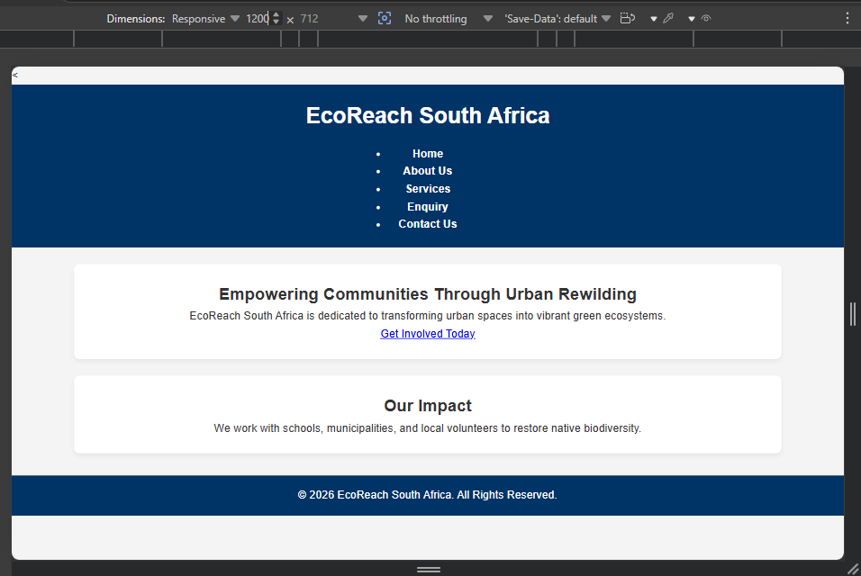
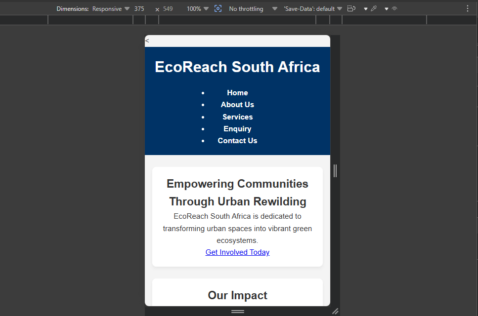

# Web Development Portfolio PoE - Part 1: Building the Foundation

## Organisation Selected
- **Name:** EcoReach South Africa
- **Type:** Non-Profit Organisation (NPO)

## Website Goals & Objectives
- Engage community members through urban rewilding initiatives.
- Provide accessible web portals for volunteer registration and corporate sponsorship enquiries.

## Key Features
- 5 Semantic HTML pages (`index.html`, `about.html`, `services.html`, `enquiry.html`, `contact.html`).
- Multi-location operational details for Cape Town and Johannesburg hubs.
- Functional HTML forms for enquiries.

## Sitemap
- Home (`index.html`)
- About Us (`about.html`)
- Services (`services.html`)
- Enquiry (`enquiry.html`)
- Contact Us (`contact.html`)

## Development Timeline & Milestones
- **Part 1:** Proposal, project setup, semantic HTML architecture, Git tracking.
- **Part 2:** CSS styling, page layouts, responsive design rules.
- **Part 3:** Client-side JavaScript validation, testing, deployment.

## Part 1 Details
- Initialized local workspace with HTML5 elements, multi-page routing, and Git setup.

## Changelog
- `2026-07-30`: Set up base directory architecture, created semantic HTML structural templates across 5 core pages, and initialized repository tracking.

## References (IIE Harvard Style)
- EcoReach South Africa, 2026. *Urban Rewilding and Community Conservation Report*. Cape Town: EcoReach Publications.
- W3C, 2023. *HTML5 Semantic Elements*. World Wide Web Consortium. [online] Available at: <https://www.w3.org/TR/html52/> [Accessed 30 July 2026].
- W3Schools, 2026. *HTML Web Building Manual*. [online] Available at: <https://www.w3schools.com/html/> [Accessed 30 July 2026].

## Responsive Design Evidence

## Responsive Design Evidence

| Viewport | Dimension | Preview Link |
| :--- | :--- | :--- |
| **Desktop** | 1200px |  |
| **Tablet** | 768px |  |
| **Mobile** | 375px |  |

# EcoReach South Africa Website - Part 2

## Part 2 Overview
This project expanded the HTML structure into a fully visual, responsive website using modular CSS stylesheet configurations, typography scales, grid layout management, interactive pseudo-classes, and responsive breakpoints.

## Changelog (Part 1 Feedback & Part 2 Updates)
- **Feedback Fix:** Linked `style.css` to all HTML documents (`about.html`, `contact.html`, `enquiry.html`, `services.html`).
- **Feedback Fix:** Standardized the navigation bar structure across all pages for consistent site routing.
- **Part 2 Enhancement:** Added a CSS reset and global layout properties (`box-sizing: border-box`, `rem` font sizes).
- **Part 2 Enhancement:** Built desktop grid layouts (`display: grid`, `flexbox`) for media elements, office locations, and service cards.
- **Part 2 Enhancement:** Added media query breakpoints (`@media (max-width: 768px)`) to collapse multi-column layouts into mobile single-column layouts.
- **Part 2 Enhancement:** Implemented responsive image handling (`srcset` and `sizes` attributes) on gallery components.

## Responsive Design Screenshots
### Desktop View

### Tablet View

### Mobile View

## References
- MDN Web Docs. (2026). *Responsive design*. Available at: https://developer.mozilla.org
- W3Schools. (2026). *CSS Media Queries*. Available at: https://www.w3schools.com/css/css_rwd_mediaqueries.asp
